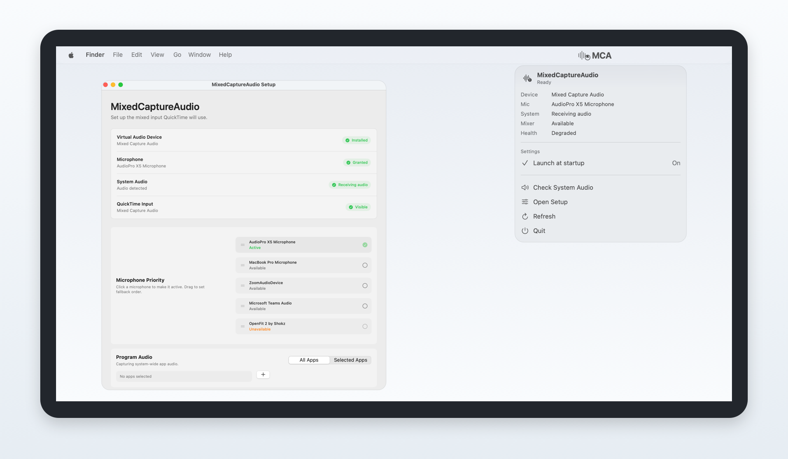
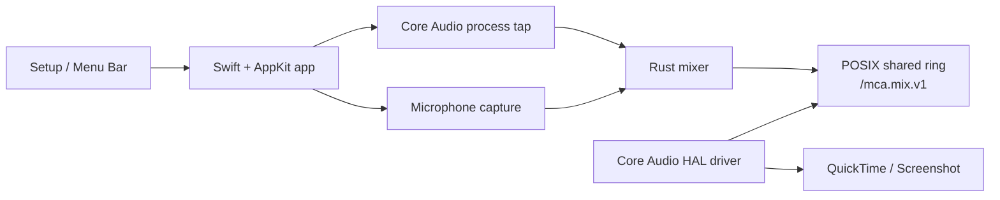

# MixedCaptureAudio

MixedCaptureAudio is a native macOS menu-bar helper that publishes a virtual Core Audio input named `Mixed Capture Audio`. Select it in QuickTime Player, Screenshot, or another recorder to capture a live mix of system audio and one microphone.

<p align="center">
  
</p>

## What It Does

- Creates a virtual microphone-style input device for macOS recording apps.
- Mixes program audio and the active microphone into one stereo stream.
- Supports all-app program audio or selected-app program audio.
- Lets you choose an active microphone and keep a fallback priority list.
- Keeps capture running from the menu-bar helper instead of exposing session start/stop controls.
- Shows local setup, permission, device, mixer, and shared-ring health diagnostics.

## How It Works

MixedCaptureAudio is split into an app, a mixer, and a HAL driver. The app owns permissions, device selection, Core Audio process taps, microphone capture, and UI. The Rust mixer owns deterministic audio mixing and shared-memory writing. The HAL driver owns the virtual input device that recording apps read from.



The HAL-facing stream is fixed at 48 kHz, stereo, interleaved `Float32`. The virtual device reads from `/mca.mix.v1`; bad, stale, or missing data becomes silence rather than blocking Core Audio.

For the deeper architecture map, see [docs/mixed-capture-audio-project-reference.md](docs/mixed-capture-audio-project-reference.md).

## Requirements

- macOS 14.2 or newer.
- Microphone permission for the app.
- System Audio permission for program-audio capture.
- A recording app that can select a Core Audio input device, such as QuickTime Player or Screenshot.

## Install And Use

1. Install the latest `MixedCaptureAudio-*.pkg` from Releases.
2. Open `MixedCaptureAudio`.
3. Grant microphone access when prompted.
4. Use `Check System Audio` while audible system audio is playing.
5. Choose the active microphone and fallback order in setup.
6. Choose `All Apps` or `Selected Apps` for program audio.
7. In QuickTime Player or Screenshot, select `Mixed Capture Audio` as the audio input.

MixedCaptureAudio itself is an `LSUIElement` menu-bar app. Closing the setup window leaves it running; use the menu-bar `Quit` action to stop it.

## Development

Run the native test/build checks directly:

```sh
cargo test --manifest-path Rust/mixed-audio-engine/Cargo.toml
xcodebuild test -project MixedCaptureAudio.xcodeproj -scheme MixedCaptureAudioTests -configuration Debug
```

Build the app, HAL driver, and unsigned installer package:

```sh
xcodebuild build -project MixedCaptureAudio.xcodeproj -scheme MixedCaptureAudioApp -configuration Debug -derivedDataPath Build/XcodeDerivedData
xcodebuild build -project MixedCaptureAudio.xcodeproj -scheme MixedCaptureAudioDriver -configuration Debug -derivedDataPath Build/XcodeDerivedData
Scripts/build-package.sh
```

Build release artifacts when signing and notarization credentials are configured:

```sh
MCA_VERSION=0.0.4 MCA_BUILD_NUMBER=123 CONFIGURATION=Release Scripts/build-package.sh --sign --notarize
```

## Repository Map

| Path | Purpose |
| --- | --- |
| `App/Sources/App/` | Swift app model, setup UI, menu-bar UI, permissions, preferences, and lifecycle control |
| `App/Sources/Audio/LiveMixerSession.m` | Objective-C capture bridge between Swift, Core Audio, microphone capture, and Rust |
| `Rust/mixed-audio-engine/` | Mixer, source queues, shared-memory writer, health counters, and Rust tests |
| `HALPlugin/` | C AudioServerPlugIn virtual input device and shared-memory reader |
| `Scripts/` | Minimal build, package, signing, notarization, install, and uninstall plumbing |
| `docs/` | Architecture, release, permissions, diagnostics, and verification notes |

## Privacy

MixedCaptureAudio does not create recordings, upload audio, or use analytics. Audio is captured locally, mixed locally, and exposed locally as a virtual Core Audio input. Recording ownership stays with the app that selected `Mixed Capture Audio`.

Local diagnostics describe device state, permission state, capture health, and shared-ring counters. They are intended for setup and troubleshooting, not telemetry.

## Troubleshooting

If `Mixed Capture Audio` is not visible in a recorder, quit and reopen the recorder first. If it is still missing, reload Core Audio or restart the Mac after installation.

If system audio is not detected, make sure something audible and unmuted is playing, then run `Check System Audio` again.

To uninstall while preserving macOS privacy decisions, open Setup and use the Advanced uninstall action.

The app then:

1. Stops the live session.
2. Disables launch at login.
3. Removes app-owned state.
4. Copies its bundled uninstaller helper.
5. Starts the copied helper through an async LaunchServices handoff.
6. Quits so the app bundle can be moved to Trash.

The Finish Uninstalling helper:

- Uses the Dock-app bundle identity `com.minamiktr.mca.uninstall` and display name `Finish Uninstalling MCA` so its window can be recovered after focus changes.
- Shows the HAL driver first, because it can be moved while the main app is quitting.
- Keeps the app row unavailable until the main app has exited; if the app does not exit promptly, the row tells the user to quit it manually and click `Check Again`.
- Reveals each remaining item in Finder so the user can move it to Trash. Finder owns any administrator password prompt.
- Minimizes instead of closing while uninstall is incomplete.
- Confirms Quit/Command-Q while uninstall is incomplete, defaults to continuing uninstall, and honors `Quit Anyway`.
- Shows next-step guidance while removal is in progress, then final restart guidance as native bullet rows after both installed items are gone.

To reset local app preferences:

```sh
defaults delete com.minamiktr.mca 2>/dev/null || true
```

To forget the installer package receipt:

```sh
sudo pkgutil --forget com.minamiktr.mca.pkg 2>/dev/null || true
```
