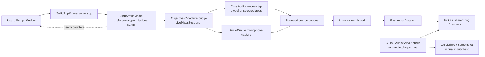
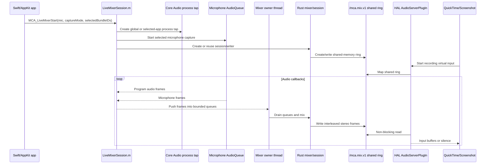

# MixedCaptureAudio Project Reference

This is the reviewer-facing map for the built MixedCaptureAudio project. It summarizes the current product contract, process boundaries, repository layout, build and release commands, verification surface, and the main constraints that should guide code review.

For deeper design rationale, read the narrower design docs listed in [Reference Reading Order](#reference-reading-order).

## Build-System Standard And Current Gap

The intended project standard is Apple-native for Apple code:

- Xcode native targets own the macOS app, HAL plug-in product modeling, framework links, resources, Info.plist files, entitlements, signing settings, schemes, and test plans.
- XCTest owns Swift/AppKit/SwiftUI unit tests.
- Swift dependencies, if added, are managed through Xcode/Swift Package Manager.
- Cargo owns Rust compilation and Rust tests.
- Scripts are limited to external integration seams: Cargo/cbindgen wrappers, generated ABI checks, packaging, signing, notarization, installation, and uninstall.

Current state: the macOS app, HAL driver, and Swift tests run through native Xcode/XCTest targets.

## Product Contract

MixedCaptureAudio is a native macOS menu-bar helper for QuickTime and Screenshot recordings. It publishes one virtual Core Audio input device named `Mixed Capture Audio` and feeds that device a live stereo mix of:

- global system audio captured by the app process
- one selected microphone captured by the app process

QuickTime, Screenshot, or another recording app owns the actual recording. MixedCaptureAudio is only the live audio path that makes the mixed input available.

V1 intentionally does not provide:

- direct screen recording
- per-app audio routing UI
- stored recordings
- audio export
- cloud upload or telemetry
- multiple virtual devices

## Stable Runtime Identities

Keep these identifiers stable unless an intentionally incompatible release plan says otherwise:

| Item | Value |
| --- | --- |
| App bundle identifier | `com.minamiktr.mca` |
| HAL driver bundle identifier | `com.minamiktr.mca.driver` |
| Virtual input name | `Mixed Capture Audio` |
| Virtual device UID | `com.minamiktr.mca.device.MixedCaptureAudio` |
| Loaded driver model UID | `com.minamiktr.mca.model.MixedCaptureAudio.driver1.shm1` |
| Shared-memory name | `/mca.mix.v1` |
| Shared-memory ABI version | `1` |
| Driver compatibility version | `1` |
| Minimum macOS version | `14.2` |

Changing any of these can affect TCC permissions, saved preferences, QuickTime device selection, app/driver compatibility checks, or existing recordings.

## Architecture

The app is split across three language/runtime boundaries:

```text
Swift/AppKit app process
  owns UI, preferences, permissions, device selection, system tap setup,
  microphone capture, lifecycle, diagnostics, and control flow

Rust static library
  owns deterministic mixer state, source queues, drift handling,
  shared-memory session writing, and health counters

C HAL AudioServerPlugIn
  owns the virtual Core Audio input device and non-blocking reads
  from the app-created shared-memory ring
```

The HAL driver is deliberately small. It does not capture audio, mix sources, prompt for permissions, call Swift, link the Rust engine, own policy, or log from the IO path. Bad, missing, stale, or insufficient data becomes silence.



## Runtime Data Flow

```text
system audio process tap
        +
selected microphone
        v
Swift/Objective-C capture bridge
        v
Rust mixer/session
        v
POSIX shared memory: /mca.mix.v1
        v
C HAL driver in Core Audio host
        v
QuickTime/Screenshot selected input
```

The fixed HAL-facing format is:

- `48000` Hz
- stereo
- interleaved `Float32`
- target shared-ring fill: `50 ms` / `2400` frames
- heartbeat stale threshold: `500 ms`

The shared-memory header and constants live in `HALPlugin/Include/MixedAudioSharedMemory.h`. Rust keeps a mechanically generated mirror in `Rust/mixed-audio-engine/src/generated_shared_memory_abi.rs`. The public Rust C ABI lives in `Rust/mixed-audio-engine/include/MixedAudioEngine.h`.



## Selected-App Relaunch Recovery

Selected-app mode passes selected bundle IDs across the Swift/Objective-C bridge. On macOS 26 SDK/runtime combinations, `LiveMixerSession.m` also sets Core Audio process-restore hints on the tap description. The app still treats those hints as best effort: if a selected app relaunches, Workspace notifications carry the changed bundle ID into a debounced recovery path, and the model force-restarts the source graph when the selected app is available. If app availability lags the launch notification, the model keeps a short retry budget so a later Core Audio process-list refresh can still trigger the fallback.

This favors recovery over the original seamless macOS 26 restore optimization. A selected-app relaunch may briefly replace the source graph, smoothed by the existing bridge/fade path, instead of relying solely on Core Audio restore to avoid graph replacement.

```mermaid
sequenceDiagram
    participant WS as NSWorkspace
    participant CA as Core Audio process list
    participant Services as DeviceChangeObserver
    participant Debounce as DebouncedMainActorAction
    participant Model as AppStatusModel
    participant Mixer as AppLiveMixerController
    participant ObjC as LiveMixerSession.m

    WS-->>Services: selected app launch/terminate(bundleID)
    CA-->>Services: process-list changed(no bundleID)
    Services->>Debounce: schedule recovery and remember bundle IDs
    Debounce-->>Model: recoverAfterApplicationAudioSourceChange(changedBundleIDs)
    Model->>Model: refresh available app sources

    alt selected bundle is available
        Model->>Mixer: force restart selected-app capture
        Mixer->>ObjC: MCA_LiveMixerStart(selectedApps, bundle list)
        ObjC->>ObjC: recreate tap, bridge/fade transition
    else selected bundle is not available yet
        Model->>Model: keep selected bundle in retry budget
        CA-->>Services: later process-list changed(no bundleID)
        Services->>Debounce: schedule recovery
        Debounce-->>Model: recoverAfterApplicationAudioSourceChange([])
        Model->>Model: refresh; pending selected bundle now available
        Model->>Mixer: force restart selected-app capture
    end
```

## User-Facing App Behavior

The app is an `LSUIElement` menu-bar utility. Its visible surfaces are:

- setup window
- menu-bar status panel
- microphone access action
- system audio access check
- microphone active selection and fallback priority
- launch-at-startup toggle
- local health/diagnostic status
- refresh and quit actions

The app starts and maintains the live mixer as an app lifecycle responsibility. The UI does not expose a normal start/stop session switch; quitting the helper is the user-visible stop boundary.

System audio verification requires audible, unmuted system playback during the check. A silent Mac can produce an inconclusive or failed access check even when permission is otherwise available.

Current setup behavior:

- The onboarding checklist can auto-confirm system audio during an active recorder session when the virtual input is running and source meters prove non-silent system audio.
- Completed onboarding rows collapse out of the default setup view while remaining reviewable.
- Computer and Voice controls include source-level meters; meter polling is scoped to setup-window visibility.
- Voice controls include balance/gain and the optional Enhance Voice compressor path.
- Selected-app capture shows selected apps inline and uses an add/search popover for discovery.

## Repository Map

| Path | Purpose |
| --- | --- |
| `App/Sources/App/` | Swift app model, prerequisite checks, setup/status UI, launch-at-startup, permission/test orchestration |
| `App/Sources/Audio/LiveMixerSession.m` | Native capture graph and Swift-to-Rust live mixer bridge |
| `App/Sources/SystemAudio/SystemAudioAccessProbe.m` | System-audio access probe used by setup/check flows |
| `App/Sources/Diagnostics/HealthDiagnostics.swift` | User-facing health summary logic |
| `AppTests/` | Transitional Swift model/status/setup tests; target state is an XCTest bundle run by Xcode |
| `App/Resources/Info.plist` | App bundle metadata, privacy strings, LSUIElement agent setting |
| `App/MixedCaptureAudio.entitlements` | App entitlements, including microphone access for Developer ID builds |
| `HALPlugin/Sources/` | C HAL AudioServerPlugIn implementation and shared-memory reader/probe code |
| `HALPlugin/Include/` | Shared C ABI headers for HAL/app/Rust verification |
| `HALPlugin/Resources/Info.plist` | HAL bundle identifier, factory metadata, compatibility metadata |
| `Rust/mixed-audio-engine/src/` | Rust mixer, session, shared-memory writer, generated ABI mirror |
| `Rust/mixed-audio-engine/tests/` | Rust mixer and drift/fill stress tests |
| `Scripts/` | Minimal active product plumbing only |
| `Packaging/` | Installer component property metadata |
| `Generated/` | Generated headers/libs; only placeholders should be committed or packaged for review |
| `TestArtifacts/` | Local proof output; only placeholders should be committed or packaged for review |
| `.Secrets/` | Local release certificates, keys, passwords, and notary material; never package for review |

## Primary Command Surface

Run native tools directly for verification:

```sh
Scripts/generate-rust-shared-memory-abi.sh --check
cargo test --manifest-path Rust/mixed-audio-engine/Cargo.toml
xcodebuild test -project MixedCaptureAudio.xcodeproj -scheme MixedCaptureAudioTests -configuration Debug
xcodebuild build -project MixedCaptureAudio.xcodeproj -scheme MixedCaptureAudioApp -configuration Debug
xcodebuild build -project MixedCaptureAudio.xcodeproj -scheme MixedCaptureAudioDriver -configuration Debug
```

Current build responsibility is split between Xcode and necessary boundary scripts:

- `MixedCaptureAudioApp` is a native Xcode macOS application target. Xcode compiles Swift/ObjC app sources, owns app Info.plist and entitlements, links system frameworks, invokes the Rust boundary build phase, and links the generated Rust static library.
- `MixedCaptureAudioTests` is a native XCTest bundle hosted by the Debug app product. Tests import the app module with `@testable import MixedCaptureAudio`; direct Swift test executables are not part of the project standard.
- `MixedCaptureAudioDriver` is a native Xcode bundle target that emits `MixedCaptureAudio.driver`. Xcode compiles the HAL C sources, expands the driver Info.plist, links CoreAudio/CoreFoundation, and signs the bundle.
- `Scripts/build-rust-engine.sh` regenerates the shared-memory ABI mirror and builds the Rust static library; Debug builds stay single-architecture, while Release builds merge `aarch64-apple-darwin` and `x86_64-apple-darwin` with `lipo`.

Focused commands:

```sh
Scripts/build-rust-engine.sh
Scripts/build-package.sh
Scripts/build-package.sh --sign
Scripts/build-package.sh --sign --notarize
Scripts/manage-installation.sh install-driver
Scripts/manage-installation.sh reload-coreaudio
Scripts/manage-installation.sh uninstall-driver
Scripts/manage-installation.sh uninstall
```

No shell script should exist unless it is active product plumbing that cannot reasonably live in Xcode, Cargo, SwiftPM, GitHub Actions, or the relevant native tool.

## Build Outputs

Normal local outputs are generated under:

```text
Build/Debug/
Build/Release/
Build/Packages/
Generated/include/
Generated/lib/debug/
Generated/lib/release/
Rust/mixed-audio-engine/target/
TestArtifacts/
```

These are generated artifacts. They are excluded by `.gitignore` and should generally be excluded from review zips. The meaningful source is the scripts and project files that recreate them.

`Generated/lib/release/libmixed_audio_engine.a` must be universal for release packaging. The app and HAL driver Release Xcode configurations likewise resolve to `ARCHS = arm64 x86_64` and `ONLY_ACTIVE_ARCH = NO`; Debug/test builds remain host-architecture focused.

## Local Development Flow

A target source review or local build loop is:

```sh
Scripts/generate-rust-shared-memory-abi.sh --check
cargo test --manifest-path Rust/mixed-audio-engine/Cargo.toml
xcodebuild test -project MixedCaptureAudio.xcodeproj -scheme MixedCaptureAudioTests -configuration Debug
xcodebuild build -project MixedCaptureAudio.xcodeproj -scheme MixedCaptureAudioApp -configuration Debug
Scripts/build-package.sh
```

For installed-driver testing:

```sh
Scripts/manage-installation.sh install-driver
Scripts/manage-installation.sh reload-coreaudio
```

For cleanup:

```sh
Scripts/manage-installation.sh uninstall-driver
Scripts/manage-installation.sh uninstall
```

Some installed-driver and release verification commands interact with system locations, Core Audio daemons, keychains, certificates, or notarization services. Run those deliberately and expect admin prompts or environment variables where appropriate.

CI uses `.github/workflows/ci.yml` to call Cargo, Xcode, and package scripts directly on macOS. Release packaging is orchestrated by `.github/workflows/release.yml`, which builds the signed/notarized package from repository secrets and uploads the `.pkg` artifact.

## Install, Reload, And Uninstall

The installed artifacts are:

```text
/Applications/MixedCaptureAudio.app
/Library/Audio/Plug-Ins/HAL/MixedCaptureAudio.driver
```

The HAL driver is discovered from the system HAL plug-ins directory and can remain loaded by Core Audio helper processes. Development reloads may need to terminate both:

- `com.apple.audio.Core-Audio-Driver-Service.helper`
- `coreaudiod`

Use `Scripts/manage-installation.sh reload-coreaudio` for that development flow. User-facing product flows should not silently kill Core Audio; the app should present clear reload/restart guidance.

`Scripts/manage-installation.sh` is the developer install lifecycle helper. It can install the built driver, reload Core Audio for local testing, remove only the driver, or uninstall the app and driver while preserving preferences and macOS privacy permission records.

## Release And Signing Inputs

Release signing expects local private material under `.Secrets/` by default, with environment-variable overrides:

| Purpose | Default / Variable |
| --- | --- |
| Developer ID Application p12 | `.Secrets/MCADeveloperIDApplicationSigning.p12` or `MCA_APP_P12_PATH` |
| Developer ID Installer p12 | `.Secrets/MCADeveloperIDInstallerSigning.p12` or `MCA_INSTALLER_P12_PATH` |
| App p12 password | `MCA_APP_P12_PASSWORD` or shared `MCA_P12_PASSWORD` |
| Installer p12 password | `MCA_INSTALLER_P12_PASSWORD` or shared `MCA_P12_PASSWORD` |
| App public certificate | `.Secrets/developerID_application.cer` or `MCA_APP_CERT_PATH` |
| Installer public certificate | `.Secrets/developerID_installer.cer` or `MCA_INSTALLER_CERT_PATH` |
| Notary key | `MCA_NOTARY_KEY_PATH` |
| Notary key ID | `MCA_NOTARY_KEY_ID` |
| Notary issuer ID | `MCA_NOTARY_ISSUER_ID` |
| Apple team ID | `MCA_TEAM_ID` |

Before release signing, the public Apple Developer ID certificate chain must be available to the host keychain. `Scripts/release-support.sh install-public-certs` exists for that setup.

Do not include `.Secrets/`, `*.p12`, `*.p8`, `*.keychain-db`, or `release.env` in review packages.

Unsigned package builds stage app and driver payloads and validate package metadata. `Scripts/build-package.sh --sign` creates a temporary signing keychain, imports Developer ID identities, restores the user's keychain state on exit, and signs the app, HAL driver, and package. `Scripts/build-package.sh --sign --notarize` also submits the signed package with `notarytool`, staples the accepted ticket, and validates the stapled package.

Starting with version `0.2.x`, release `.pkg` installers support universal macOS architecture. Release package builds must contain both `arm64` and `x86_64` slices. Unless `XCODE_DESTINATION` is explicitly set, `Scripts/build-package.sh` uses Xcode's generic macOS destination for Release so Xcode builds both slices instead of a host-specific `My Mac` product. It fails the package build if the built app executable, built HAL driver executable, generated Release Rust static library, or expanded package payload executables are missing either slice.

## Verification Expectations

For ordinary code review, use native tools directly:

```sh
cargo test --manifest-path Rust/mixed-audio-engine/Cargo.toml
xcodebuild test -project MixedCaptureAudio.xcodeproj -scheme MixedCaptureAudioTests -configuration Debug
xcodebuild build -project MixedCaptureAudio.xcodeproj -scheme MixedCaptureAudioApp -configuration Debug
Scripts/build-package.sh
```

For syntax and metadata spot checks:

```sh
find Scripts -maxdepth 1 -type f -print0 | xargs -0 sh -n
plutil -lint App/Resources/Info.plist HALPlugin/Resources/Info.plist MixedCaptureAudio.xcodeproj/project.pbxproj Packaging/MixedCaptureAudioComponentProperties.plist
```

Manual end-to-end evidence still depends on real macOS audio conditions:

- installed HAL driver visible to Core Audio
- `Mixed Capture Audio` visible as an input device
- microphone permission granted
- system audio access granted
- audible system playback during system audio checks
- QuickTime/Screenshot recording using `Mixed Capture Audio`

## Privacy And Diagnostics Rules

MixedCaptureAudio must not store recordings or audio content.

Allowed diagnostics are setup state, versions, permission state, selected device metadata, transport health counters, and non-audio errors. Disallowed diagnostics include:

- audio samples or buffers
- raw mic, system, or mixed audio
- QuickTime recordings
- transcripts
- window titles
- browser tab titles
- screen captures
- process/window activity history
- secret tokens or release credentials

Do not log from audio callbacks or HAL IO callbacks. Real-time paths should update counters only.

## Review Cautions

These are recurring mistakes worth checking during review:

- Do not move capture, mixing, permissions, logging, or policy into the HAL driver.
- Do not make the HAL IO path block, allocate in a risky way, or call into Swift/Rust app code.
- Do not make missing or stale shared memory an error tone or stale replay; it must become silence.
- Do not change shared-memory layout, fixed output format, target fill, or object name without an ABI/version plan.
- Do not treat priority order as the same thing as active microphone selection.
- Do not persist app-owned private aggregate devices as user-selectable microphones.
- Do not restart the full shared-memory transport for ordinary mic fallback or source-graph recovery.
- Do not rely only on `coreaudiod` restart when testing driver metadata changes; the Core Audio driver-service helper can keep stale HAL code loaded.
- Do not trust sandboxed Developer ID signature failures as final release evidence; verify release artifacts outside restricted tool sandboxes when signing/trust is the question.
- Do not package `.Secrets/` or generated local build products for external review.
- Do not treat QuickTime as the first HAL test; verify native builds and installed-driver state first, then run QuickTime/Screenshot acceptance.

## Reference Reading Order

Start here:

1. `docs/mixed-capture-audio-project-reference.md`
2. `docs/quicktime-mixed-audio-helper-architecture-and-process-boundaries.md`
3. `docs/quicktime-mixed-audio-helper-repo-and-build-system.md`
4. `docs/quicktime-mixed-audio-helper-test-and-validation-plan.md`
5. `docs/quicktime-mixed-audio-helper-update-and-installation-strategy.md`

Then use focused docs as needed:

- HAL details: `docs/quicktime-mixed-audio-helper-hal-plugin-spec.md`
- Rust mixer details: `docs/quicktime-mixed-audio-helper-rust-audio-engine-spec.md`
- permissions/user flows: `docs/quicktime-mixed-audio-helper-permissions-and-user-flows.md`
- diagnostics/privacy: `docs/quicktime-mixed-audio-helper-diagnostics-preferences-and-privacy.md`
- plist metadata: `docs/quicktime-mixed-audio-helper-plist-requirements.md`
- unresolved or environment-sensitive confirmations: `docs/quicktime-mixed-audio-helper-remaining-confirmations.md`
